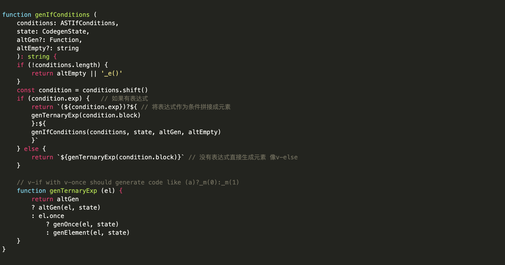
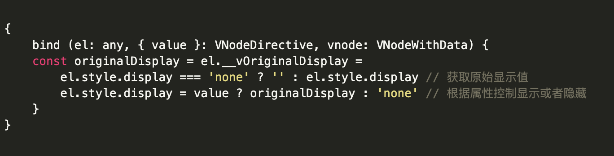
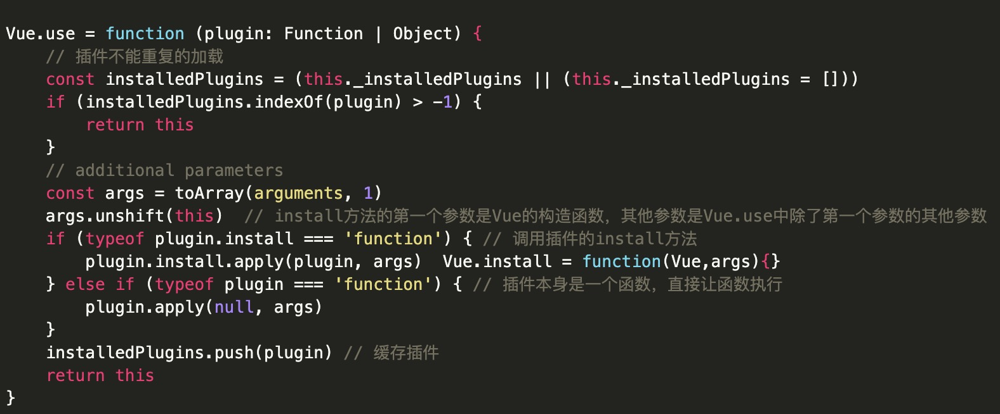
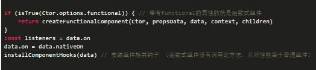
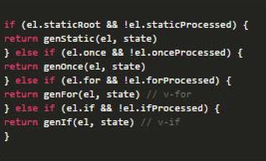
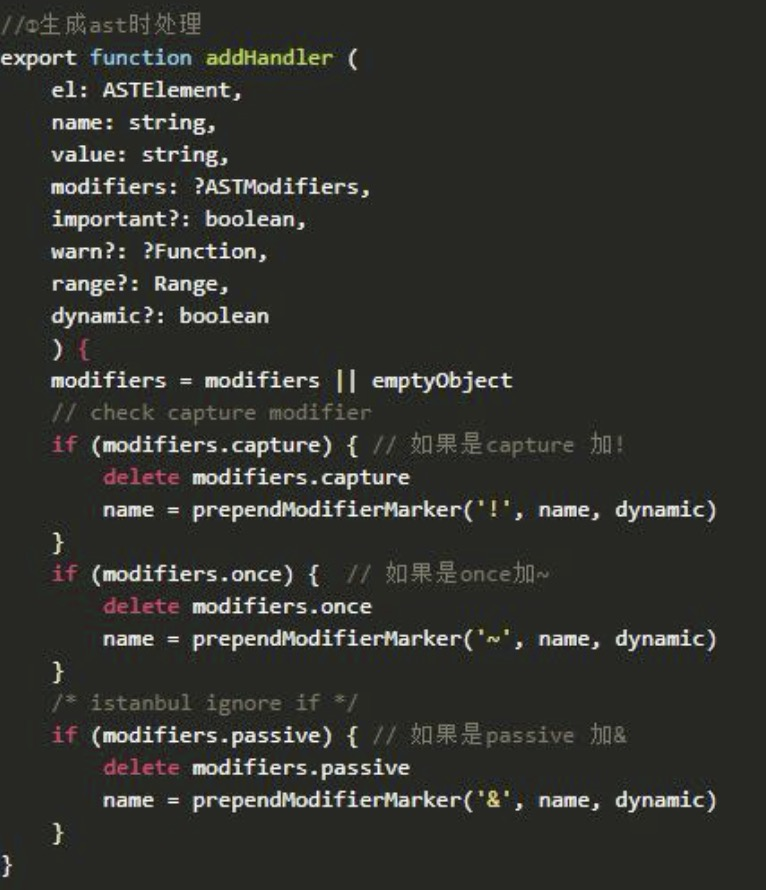
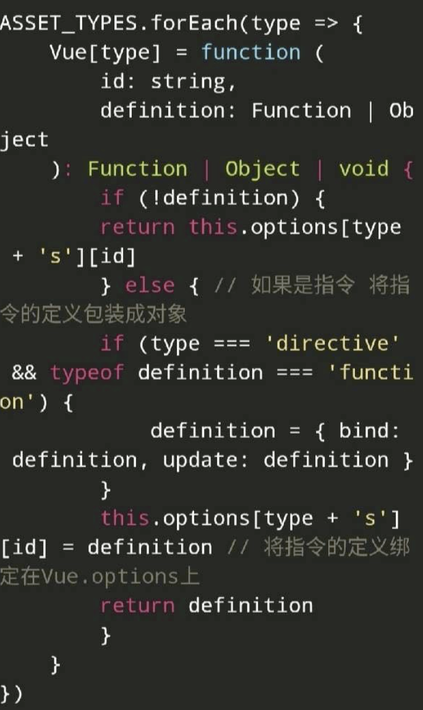
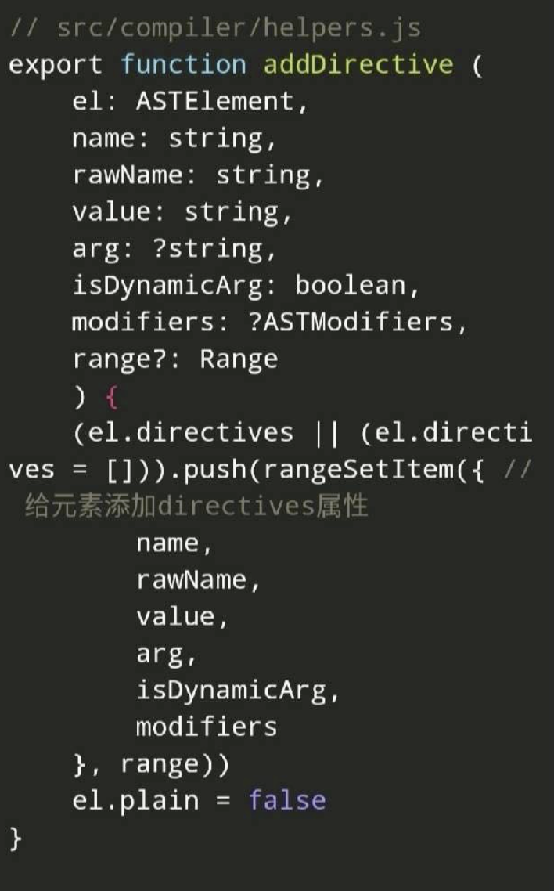

# 每日一题
## 1、 说一下响应式数据的理解？##
- 核心考察的是：数组和对象类型当值变化时是如何劫持到。对象内部通过defineReactive方法，使用Object.defineProperty将属性进行劫持（只会劫持已经存在的属性），数组则
  是通过重写数组方法来实现。这里在回答时可以带出一些相关知识（比如多层对象是通过递归来实现劫持，顺带剔除Vue3中时使用proxy来实现响应式数据）
- 核心点后可以进行补充回答，内部依赖收集是怎样做到的，每个属性都拥有自己的dep实例，存放他所依赖的watcher，当属性变化后会通知自己对应的watcher去更新
  （其实后面会讲到每个对象类型本身拥有一个dep属性，这个在$set面试题时讲解）
- 这里可以引出性能优化相关内容
    1. 对象层级多深，性能就会差 
    2. 不需要响应数据的内容不要放到data中
    3. Object.freeze()可以冻结数据.冻结对象，不能修改对象及原型上的任何东西
## 2、Vue如何检测数组变化？##
- 核心点考察的是：数组考虑性能原因没有用defineProperty对数组的每一项进行拦截，二是选择重写数组（push、shift、pop、splice、unshift、sort、reserve)方法进行重写
- 核心点答出来也可以再进行补充回答，在Vue中修改数组的索引和长度是无法监控到的。需要通过以上7中变异方法修改数组才会触发数组对应的watcher进行更新，数组中如果是对象数据
  类型也会进行递归劫持
- 引发出的问题，那如果想要更改索引更新数据怎么办？可以通过``Vue.$set（）``来进行处理 => 核心内部用的是splice方法
## 3、vue中模版编译原理？##
- 核心考察的是：如何将template转换成render函数（这里需要注意的是我们在开发过程中尽量不要使用template，因为将template准化成render方法需要在运行时进行编译操作会有性能损耗，
  同时引用带有compiler包的vue体积也会变大。默认.vue文件中的template处理是通过vue-loader来进行处理的，并不是通过运行时候编译，后面我们会说到默认vue项目中引入的vue.js是不带有
  compliler模块的）
  1. 将template模版转换成ast语法树
  2. 对静态语法做静态标记
  3. 重新生成代码
- 核心打出来了也可以再进行补充回答（模版引擎的实现原理就是new Function + with来进行实现的）
- vue-loader中处理template属性主要靠的是vue-template-compiler模块
```
const VueTemplateCompiler = require('vue-template-compiler');
const {render} = VueTemplateCompiler.compile("<div id="hello">{{msg}}</div>");
console.log(render.toString());
```

## 4、生命周期钩子是怎么实现的？##
- 核心点考察的是：Vue的生命周期钩子就是回调函数而已，当创建组件实例的过程中会调用对应的钩子方法。
- 核心点答出来了也可以再进行补充回答：内部主要是使用callHook方法来调用对应的方法。核心是一个发布订阅模式，将钩子订阅好（内部采用数组的方式存储），在对应阶段进行发布。

## 5、vue.mixin的使用场景？ ##
- 核心点考察的是：Vue.mixin的作用就是抽离公共的业务逻辑，原理类似“对象的继承”，当组件初始化时调用mergeOptions方法进行合并，采用策略模式针对不同的属性进行合并，如果混入的数据
  和本身组件中的数据冲突，会采用“就近原则”以组件的数据为准。
- 核心点答出来了也可以再进行补充回答：mixin中有很多缺陷，“命名冲突问题”，“依赖问题”，“数据源问题”，这里强调一下mixin的数据是不会被共享的！

## 6、nextTick的使用场景？ ##
- 核心点考察的是：nextTick中的回调是在下次DOM更新循环结束之后执行的延迟回调，在修改数据之后立即使用这个方法，获取更新后的DOM，原理就是异步方法（promise,mutationObserver,        setImmediate,setTimeout）经常与事件环一起来问（宏任务，微任务）
- 核心点答出来了也可以再进行补充回答：vue多次更新数据，最终会进行批处理更新。内部调用的就是nextTick实现了延迟更新，用户自定义的nextTick中的回调会被延迟到更新完成后调用，从而可以获取更新后的DOM

## 7、vue为什么需要用虚拟DOM ##
- 核心点考核是：vDOM就是用js对象来描述真实DOM，是对真实DOM的抽象，由于直接操作DOM性能低，但是js层的操作效率高，可以将DOM操作转化成对象操作，最终通过diff算法比对差异进行跟新DOM（减少对真实DOM的操作）。虚拟DOM不依赖真实平台环境从而也可以实现跨平台。
- 核心点答出来了也可以再进行补充回答：虚拟DOM的实现就是普通对象包含tag、attrs、children等属性对真实节点的描述。（本质就是在js和DOM之间的一个缓存）

## 8、vue中diff的原理 ##
- 核心点考察的是：Vue的diff算法是平级比较，不考虑跨级比较的情况，内部采用深度递归的方式 + 双指针的方式进行比较。
- 比较过程
  1. 先比较是否是相同节点
  2. 相同节点比较属性，并复用老节点
  3. 比较儿子节点，考虑老节点和新节点儿子的情况
  4. 优化比较：头头、尾尾、头尾、尾头
  5. 比对查找进行复用
- VUE3中采用最长递增子序列实现diff算法

## 9、既然Vue通过数据劫持可以精准探测数据变化，为什么还需要虚拟DOM进行diff检测差异？##
- 核心点考察的是：响应式数据变化，Vue确实可以在数据发生变化时，响应式系统可以立刻得知。但是如果给每个属性都添加watcher用于更新的话，会产生大量的watcher从而降低性能。而且粒度过细也会导致不精准的问题，所以Vue采用了组件级的watcher配合diff来检测差异。
- 这里可以说说diff算法

## 10、Vue中computed和watch的区别？##
- 核心点考察的是：computed和watch都是基于Watcher来实现的，分别是计算属性watcher和用户watcher。computed属性是具备缓存的，依赖的值不发生变化，对其取值时计算属性方法不会重新执行（可以模版渲染，取值的过程中不支持异步方法）watch则是监控值的变化，当值发生变化时调用对应的回调函数。
- 核心点答出来也可以再进行补充回答：computed不会立即执行，内部通过defineProperty进行定义。并且通过dirty属性来检测依赖的数据是否发生变化。watch则是立即执行将老值保存在watcher上，当数据更新是重新计算新值，将新值和老值传递到回调函数中。

## 11、Vue.set方法是如何实现的？##
- 核心点考察的是：为什么$set可以触发更新，我们给对象和数组本身都增加了dep属性，当给对象新增不存在的属性则触发依赖的watcher去更新，当修改数组索引时我们调用数组本身的splice方法去更新数组。
```
export function set (target: Array | Object, key: any, val: any): any {
    // 1.是开发环境 target 没定义或者是基础类型则报错
    if (process.env.NODE_ENV !== 'production' &&
        (isUndef(target) || isPrimitive(target))
    ) {
        warn(`Cannot set reactive property on undefined, null, or primitive value: ${(target: any)}`)
    }
    // 2.如果是数组 Vue.set(array,1,100); 调用我们重写的splice方法 (这样可以更新视图)
    if (Array.isArray(target) && isValidArrayIndex(key)) {
        target.length = Math.max(target.length, key)
        target.splice(key, 1, val)
        return val
    }
    // 3.如果是对象本身的属性，则直接添加即可
    if (key in target && !(key in Object.prototype)) {
        target[key] = val
        return val
    }
    const ob = (target: any).__ob__
    // 4.如果是Vue实例 或 根数据data时 报错
    if (target._isVue || (ob && ob.vmCount)) {
        process.env.NODE_ENV !== 'production' && warn(
        'Avoid adding reactive properties to a Vue instance or its root $data ' +
        'at runtime - declare it upfront in the data option.'
        )
        return val
    }
    // 5.如果不是响应式的也不需要将其定义成响应式属性
    if (!ob) {
        target[key] = val
        return val
    }
    // 6.将属性定义成响应式的
    defineReactive(ob.value, key, val)
    // 7.通知视图更新
    ob.dep.notify()
    return val
}
```

## 12、Vue的生命周期方法有哪些？一般在哪一步发起请求及原因？##
- 核心点考察的是：vue组件生命周期中能做什么事情
  - beforeCreate: 在实例化之后，数据观测（data observer）和 event/watcher事件配置之前被调用。
  - created: 实例已经创建完成之后被调用。在这一步，实例已完成以下的配置：数据观测（data observer），属性和方法的运算，watch/event事件回调。这里没有$el
  - beforeMount: 在挂载开始之前被调用：相关的render函数首次被调用
  - mounted: el被创建的vm.$el替换，并且挂载到实例上去之后调用该钩子
  - beforeUpdate: 数据更新时调用，发生在虚拟DOM重新渲染和打补丁之前。
  - updated: 由于数据更改导致的虚拟DOM重新渲染和打补丁，在这之后会调用该钩子
  - beforeDestroy: 实例销毁之前调用。在这一步，实例仍然完全可用。
  - destroyed: Vue实例销毁后调用。调用后，Vue实例指示的所有东西都会接触绑定，所有的事件监听会被移除，所有的子实例也会被销毁。该钩子在服务器端渲染期间不被调用。
- 钩子函数的作用
  - created实例已经创建完成，因为它是最早触发的原因可以进行一些数据，资源的请求。（服务端渲染支持）
  - mounted实例已经挂载完成，可以进行一些DOM操作。
  - beforeUpdate可以在这个钩子中进一步的更改状态，这不会触发附加的渲染过程。
  - updated可以执行依赖于DOM的操作，然而在大多数情况下，你应该避免在此期间更改状态，因为这可能会导致更新无限渲染。该钩子在服务器端不可用
  - destroyed可以进行一些优化操作，清空定时器，解除绑定事件
- 在哪发送请求都可以，主要看具体你要做什么
  
## 13、Vue组件间传值的方式及之间的区别 ##
- 核心点考察的是：vue组件的通信方式 
  - props和$emit 父组件向子组件传递数据是通过prop传递的，子组件传递数据给父组件是通过$emit触发事件来做到的。
  - $parent，$children，获取当前组件的父组件和当前组件的子组件
  - $attrs和$listeners A->B->C。VUe2.4开始提供了$attrs和$listeners来解决这个问题。
  - 父组件中通过provide来提供变量，然后在子组件中通过inject来注入变量
  - $refs获取实例
  - eventBus平级组件数据传递，这种情况下可以使用中央事件总线的方式
  - vuex状态管理

## 14、$attrs是为了解决什么问题出现的？应用场景有哪些？provide/inject不能解决它能解决的问题吗？
- 核心考察的是：$attrs主要的作用就是实现批量传递数据，provide/inject更适合应用在插件中，主要实现跨级数据传递。

## 15、Vue的组件渲染流程 ##
- 核心考察的是：
  - 父子组件渲染的先后顺序。
  - 组件是如何渲染到页面上的
```
<template>
  <app></app> <!--这个是$vnode 占位符节点>
</template>
```
1. 在渲染父组件时创建父组件的虚拟节点，其中可能包含子组件的标签。
2. 在创建虚拟节点时，获取组件的定义使用Vue.extend生成组件的构造函数。
3. 将虚拟节点转化成真实节点时，会创建组件的实例并且调用组件的$mount方法。
4. 所以组件的创建过程是先父后子

## 16、Vue中组件的data为什么是一个函数 ##
- 核心考察点是：每次使用组件时都会对组件进行实例化操作，并且调用data函数返回一个对象作为组件的数据源。这样可以保证多个组件间数据互不影响。
- 例如：
```
class Vue{
  constructor(options) {
    this.data = options.data()
  }
}
let data = () => ({a: 1})
let d1 = new Vue({data})
let d2 = new Vue({data})
d1.data.a = 100;
console.log(d2.data.a) // 1
```

## 17、请说下v-if和v-show的区别？##
- 核心点考察的是：v-if在编译过程中会被转化成三元表达式，条件不满足是不渲染此节点。v-show会被编译成指令，条件不满足时控制样式将对应节点隐藏（内部其他指令依旧会继续执行）
- 扩展回答：频繁控制显示隐藏尽量不要使用v-if，v-if和v-for尽量不要连用
- 
- 

## 18、Vue.use是干什么的？原理是什么 ##
- 核心点考察的是：Vue.use是用来使用插件的，我们可以在插件中扩展全局组件、指令、原型方法。
- 

## 19、vue-router有几种钩子函数？具体是什么及执行流程是怎样的？##
- 核心考察点是：路由钩子的执行流程，钩子函数种类有：全局守卫、路由守卫、组件守卫
- 完整的导航解析流程：
  1. 导航被触发
  2. 在失活的组件里调用beforeRouteLeave守卫。
  3. 调用全局的beforeEach守卫
  4. 在重用的组件里调用beforeRouteUpdate守卫
  5. 在路由配置里调用beforeEnter
  6. 解析异步路由组件
  7. 在被激活的组件里调用beforeRouteEnter
  8. 调用全局的beforeResolve守卫
  9. 导航被确认
  10. 调用全局的afterEach钩子
  11. 触发DOM更新
  12. 调用beforeRouteEnter守卫中传给next的回调函数，创建好的组件实例会作为回调函数的参数传入

## 20、vue-router两种模式的区别 ##
- 核心考察点是：hash模式、history模式
- hash模式：hash + hashChange兼容性好但是不美观
- history模式：historyApi + popState虽然美观，但是刷新会出现404，需要后端进行配置

## 21、函数式组件的优势及原理 ##
- 核心点考察的是：函数式组件的特性。无状态，无生命周期，无this
- 

## 22、v-if和v-for的优先级 ##
- 核心考察点是：v-for和v-if不要在同一个标签中使用。因为解析时先解析v-for再解析v-if。如果遇到需要同时使用是可以考虑写成计算属性的方式。
- 

## 23、组件中name选项有哪些好处及作用？##
- 核心点考察的是：name属性的使用场景。
- 可以通过名字找到对应的组件（递归组件）
- 可以通过name属性实现缓存功能（keep-alive）
- 可以通过name来识别组件（跨级组件通信时非常重要）

## 24、vue事件修饰符有哪些？其实现原理是什么？ ##
- 核心点考察的是：修饰符如何实现
- 事件修饰符有：stop、prevent、capture、self、once、passive
- 
- 

## 25、vue-directive源码实现 ##
- 核心考察点是：指令的实现原理
- 

## 26、如何理解自定义指令？##
- 核心点考察的是：指令的实现原理，可以从编译原理=>代码生成=>指令钩子实现进行概述。
- 在生成ast语法树是，遇到指令会给当前元素添加directive属性
- 通过genDirectives生成指令代码
- 在patch前将指令的钩子提取到cbs中，在patch过程中调用对应的钩子
- 当执行指令对应钩子函数时，调用对应指令定义的方法。
- 
- 

## 对vuex的理解 ##
- vue是单向数据流。内部数据传递的方式是父传子。
- 如果碰到同级组件共用一个状态或者多个试图共用一个状态，这样如果一直采用父传子的方式项目会变得极复杂并难以维护
- 所以，把这些公共状态抽离出来封成一个独立的全局单例模式

## vue中slot是如何实现的？什么时候使用它 ##
- 让子组件显示一些父组件的元素时，使用插槽能把定义在父组件的元素在子组件约定位置显示
- 在子组件中使用div标签，并定义slot属性等于某值来约定插槽位置，在父组件中使用slot标签并定义name属性来约定匹配插槽